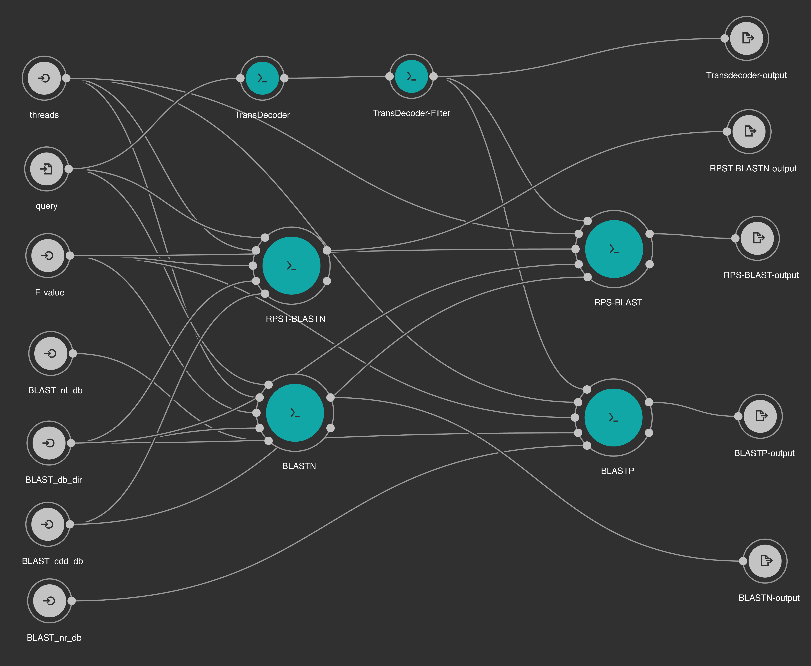
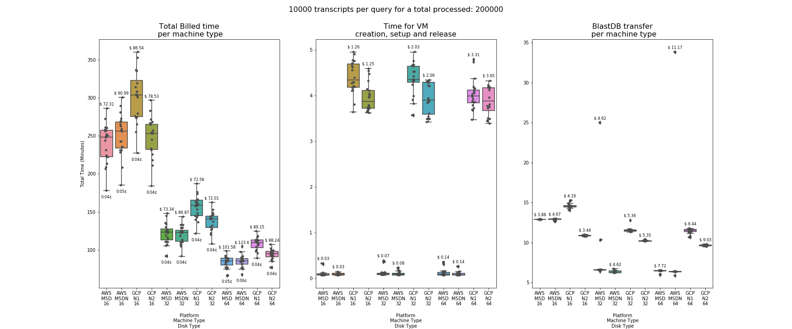
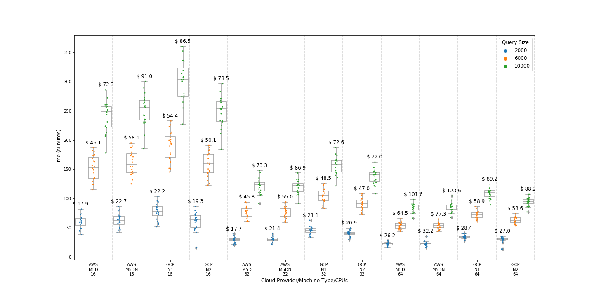

# Cloud comparison for Transcript-Annotation data analysis pipeline

## Introduction

The annotation of mRNA transcripts with functional and biological processes is an important step in developing an understanding of the biological complexity of an organism. Annotation is a complex process that requires the integration of multiple biological databases with several software tools.
 
A review of published manuscripts since 2012 [1-9] reveals that many pipelines have a common core component which is the NCBI BLAST sequence comparison tool [10]. BLAST is used to align an assembled transcriptome against annotated databases of nucleotides or proteins. After an assembly, these alignments are the first step to identifying close and/or distant homologous genes, proteins, and functional domains that could be cross-referenced with other public databases, such as Gene Ontology [11], to generate new annotations on an unkown set of sequeneces.

Our study is based on a workflow for [transcriptome annotation](./bin/cwl-ngs-workflows-cbb/workflows/Annotation/transcriptome_annotation.cwl). 



This workflow is comprised of five steps that include the key steps required for the transcriptome annotation. First, TransDecoder [12] is used to generate all open reading frames (ORFs) from the transcripts. Then, BLASTP and RPS-BLAST are used to generate a list of homologous proteins and conserved domains. BLASTP uses the BLAST non-redundant database (nr), and RPS-BLAST uses the NCBI Conserved Domain Database (CDD)[13]. In parallel, BLASTN and RPST-BLASTN are executed, using the BLAST nucleotide database (nt) and the NCBI CDD database, respectively. These steps generate a list of homologous genes and conserved domains. The workflow uses as input a FASTA file (query), with multiple transcripts to process. We also analyzed variations in the query size (i.e. the number of transcripts (sequences) in the file).
 
We used the transcriptome assembled from a public BioProject (ID [PRJNA320545](https://www.ncbi.nlm.nih.gov/bioproject/PRJNA320545)) from the organism, Opuntia streptacantha, the prickly pear. The transcriptome includes 474,563 transcripts. From this pool of transcripts, three types of query files (FASTA files) were randomly generated, with 2,000, 6,000, and 10,000 transcripts in each. For each query size, 20 different files were generated and processed independently.

### Cloud platforms

We tested our pipeline on two cloud providers, the Google Cloud Platorm (GCP) and on the Amazon Web Servises (AWS) using similar machine types. First (labbeled N1), second (labbeled N2) generation machines from GCP and second generation (M5D and M5DN) instances from AWS were tested with 16, 32 and 64 CPUs.

| Provider | Instance Size | vCPU | Memory (GiB) | Instance Storage (GiB) | Network Bandwidth (Gbps) |  $/Hour |
|---------|---------|----------|----------|-------------|---------------|-----------|
| AWS | m5d.4xlarge | 16 | 64 | 2 x 300 NVMe SSD | Up to 10 | 0.904 |
| AWS | m5d.8xlarge | 32 | 128 | 2 x 600 NVMe SSD | 10 | 1.808 |
| AWS | m5d.16xlarge | 64 | 256 | 4 x 600 NVMe SSD | 20 | 3.616 |
| AWS | m5dn.4xlarge | 16 | 64 | 2 x 300 NVMe SSD | Up to 25 | 1.088 |
| AWS | m5dn.8xlarge | 32 | 128 | 2 x 600 NVMe SSD | 25 | 2.176 |
| AWS | m5dn.16xlarge | 64 | 256 | 4 x 600 NVMe SSD | 75 | 4.352 |
| GCP | n1-standard-16 | 16 | 60 | 24 x 375 NVMe SSD | 32 | 0.861 |
| GCP | n1-standard-32 | 32 | 120 | 24 x 375 NVMe SSD | 32 | 1.393 |
| GCP | n1-standard-64 | 64 | 240 | 24 x 375 NVMe SSD | 32 | 2.475 |
| GCP | n2-standard-16 | 16 | 64 | 24 x 375 NVMe SSD | 32 | 0.951 |
| GCP | n2-standard-32 | 32 | 128 | 24 x 375 NVMe SSD | 32 | 1.572 |
| GCP | n2-standard-64 | 64 | 256 | 24 x 375 NVMe SSD | 32 | 2.816 |

### Docker image

The docker image used on the instances to process the sample files is freely available on the GCP Container Registry. The bioinformatics tools used are installed with Conda/Bioconda during image creation. The conda environment file used is [conda-trans-annot.yaml](./config/gcp/docker/conda-trans-annot.yaml)

#### Pull the image

```
docker pull gcr.io/cbb-research-dl/transannot-cloud-cmp
```

#### Build the image

The Dockerfile used to create this image is available on the `config/gcp/docker` folder.

```
cd config/gcp/docker
docker build -t transannot .
```

### AWS custom AMI

A custom [Amazon Machine Image](https://docs.aws.amazon.com/AWSEC2/latest/UserGuide/AMIs.html), which is public available with ID: **ami-0dac0383cac1dc96e** in the **us-east-1** zone, was used by the ECs for launching on-demand instances. This AMI creates an array with the local sdd NVME disks in the instance using the linux utility *mdadm*. The resulted array is formated with XFS filesystem and mounted in a folder named */data*.  

## Results
 
Times and cost are shown in the next figure. First, in the top of the figure, total running time and cost per configuration for the 20 sample files processed is shown. Each sample file can be identified with a color. They keep their relative position on each configuration demonstrating that there is not outliers due to specific problems with the instances. Second, in the bottom of the figure three plots are shown. In these cases, the cost on each configuration is expressed in percent of the total cost. The plot in the left shows the time for instance creation, setup and release. The plot in the middle show the time to transfer the BLAST databases, currently 342 GB (including nt, nr and CDD) to the instance local disk. Finally, the plot in the right shows the time to execute the CWL workflow analysis.



The next figure shows total running time for all tested configuration and query sizes.



## Notebooks

 1. [00 - Project Report](./notebooks/00%20-%20Project%20Report.ipynb) This notebook shows the final figures generated from the resulting files of both cloud providers.
 2. [01 - Data Partitioning](./notebooks/01%20-%20Data%20Partitioning.ipynb) This notebook is used to generate 20 FASTA file from the Nopal transcriptome to be tested on each cloud provider.
 3. [02 - Google cloud Platform](./notebooks/02%20-%20Google%20cloud%20Platform.ipynb) This is the notebook used to process the 20 FASTA files on GCP.
 4. [02 - AWS](./notebooks/02%20-%20AWS-Batch.ipynb)  This is the notebook used to process the 20 FASTA files on AWS.

## Basic requirements

1. Miniconda Python 3.7.x

## Installation

### Installing Miniconda

Download and execute the Miniconda installer. Us all default instructions. 

```bash
$ wget https://repo.anaconda.com/miniconda/Miniconda3-latest-Linux-x86_64.sh
$ sh ./Miniconda3-latest-MacOSX-x86_64.sh
```

### Instalation of Conda environment

```bash
$ wget https://raw.githubusercontent.com/ncbi/cloud-transcriptome-annotation/master/environment.yml
$ conda env create -f environment.yml
```

## Cloning the repo and starting the Jupyter Notebook server

```bash
$ conda activate bioconda
$ git clone https://github.com/ncbi/cloud-transcriptome-annotation
$ jupyter notebook
```

Notebooks are located in the folder `notebooks`

### References

1.	Al-Qurainy, F. et al. Comprehensive Stress-Based De Novo Transcriptome Assembly and Annotation of Guar (Cyamopsis tetragonoloba (L.) Taub.): An Important Industrial and Forage Crop. Int J Genomics 2019, 7295859, doi:10.1155/2019/7295859 (2019).
2.	Chabikwa, T. G., Barbier, F. F., Tanurdzic, M. & Beveridge, C. A. De novo transcriptome assembly and annotation for gene discovery in avocado, macadamia and mango. Sci Data 7, 9, doi:10.1038/s41597-019-0350-9 (2020).
3.	Ji, P. et al. Characterization of common carp transcriptome: sequencing, de novo assembly, annotation and comparative genomics. PLoS One 7, e35152, doi:10.1371/journal.pone.0035152 (2012).
4.	Torre, S. et al. RNA-seq analysis of Quercus pubescens Leaves: de novo transcriptome assembly, annotation and functional markers development. PLoS One 9, e112487, doi:10.1371/journal.pone.0112487 (2014).
5.	Carruthers, M. et al. De novo transcriptome assembly, annotation and comparison of four ecological and evolutionary model salmonid fish species. BMC Genomics 19, 32, doi:10.1186/s12864-017-4379-x (2018).
6.	Haas, B. J. et al. De novo transcript sequence reconstruction from RNA-seq using the Trinity platform for reference generation and analysis. Nat Protoc 8, 1494-1512, doi:10.1038/nprot.2013.084 (2013).
7.	Bryant, D. M. et al. A Tissue-Mapped Axolotl De Novo Transcriptome Enables Identification of Limb Regeneration Factors. Cell Rep 18, 762-776, doi:10.1016/j.celrep.2016.12.063 (2017).
8.	Vera Alvarez, R. et al. Workflow and web application for annotating NCBI BioProject transcriptome data. Database (Oxford) 2017, doi:10.1093/database/bax008 (2017).
9.	Gamez, R. M. et al. Banana (Musa acuminata) transcriptome profiling in response to rhizobacteria: Bacillus amyloliquefaciens Bs006 and Pseudomonas fluorescens Ps006. BMC Genomics 20, 378, doi:10.1186/s12864-019-5763-5 (2019).
10.	Altschul, S. F., Gish, W., Miller, W., Myers, E. W. & Lipman, D. J. Basic local alignment search tool. J Mol Biol 215, 403-410, doi:10.1016/S0022-2836(05)80360-2 (1990).
11.	Ashburner, M. et al. Gene ontology: tool for the unification of biology. The Gene Ontology Consortium. Nat Genet 25, 25-29, doi:10.1038/75556 (2000).
12.	Haas, B. & Papanicolaou, A. TransDecoder (Find Coding Regions Within Transcripts), <https://github.com/TransDecoder/TransDecoder/wiki> (2020).
13.	Yang, M., Derbyshire, M. K., Yamashita, R. A. & Marchler-Bauer, A. NCBI's Conserved Domain Database and Tools for Protein Domain Analysis. Curr Protoc Bioinformatics 69, e90, doi:10.1002/cpbi.90 (2020).
  

# Public Domain notice

National Center for Biotechnology Information.

This software is a "United States Government Work" under the terms of the United States
Copyright Act. It was written as part of the authors' official duties as United States
Government employees and thus cannot be copyrighted. This software is freely available
to the public for use. The National Library of Medicine and the U.S. Government have not
 placed any restriction on its use or reproduction.

Although all reasonable efforts have been taken to ensure the accuracy and reliability
of the software and data, the NLM and the U.S. Government do not and cannot warrant the
performance or results that may be obtained by using this software or data. The NLM and
the U.S. Government disclaim all warranties, express or implied, including warranties
of performance, merchantability or fitness for any particular purpose.

Please cite NCBI in any work or product based on this material.
